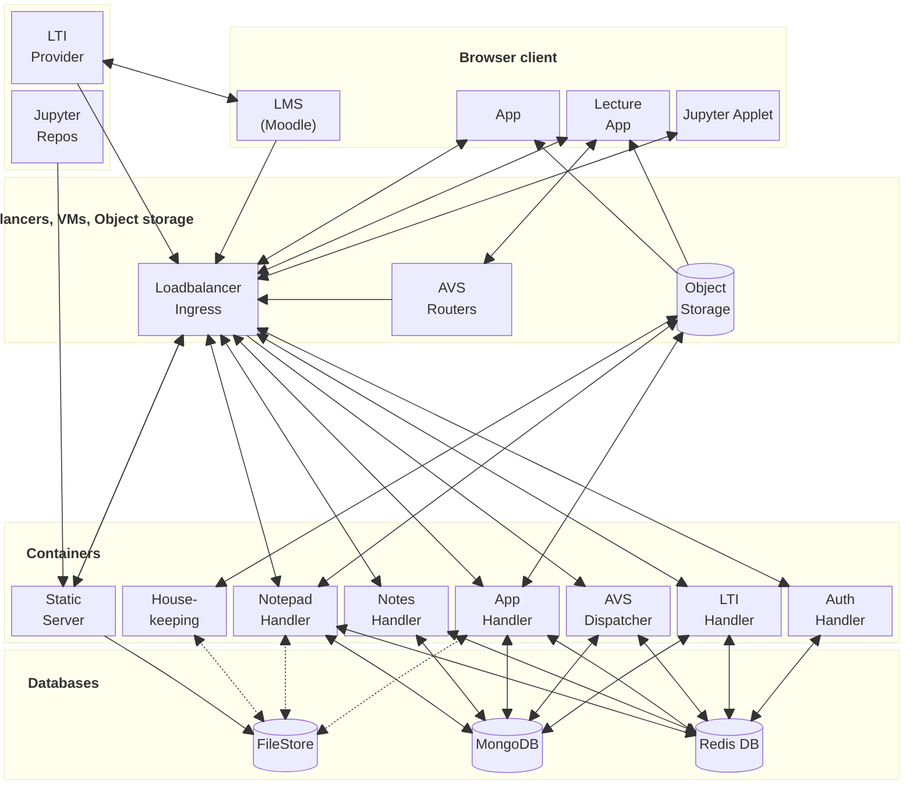
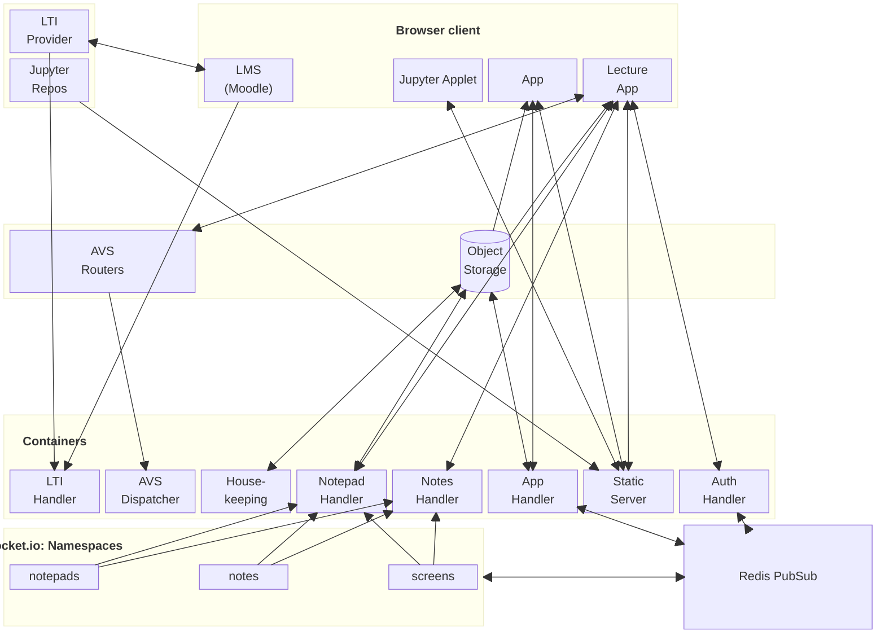

# Overview over FAILS' architecture

Fails is internally divided into several microservices, which we call handlers.
Each handler runs in its own dedicated container.
We provide two primary routes for setting up FAILS:
- **Docker Compose:** Suitable for small setups and development environments.
- **Kubernetes (Helm Chart):** Recommended for larger, production deployments.

FAILS relies on two core database services:
- **MongoDB:** Stores users, lecture content, lecture boards, and manages the bookkeeping of all digital assets (including pictures, Jupyter notebooks and background PDFs).
- **Redis DB:** Holds session data for lecture boards, most configuration details during a live lecture, and manages private and public keys used for authentication across all handlers. It is also responsible for transporting `socket.io` messages between different handlers.

**Note:** Only MongoDB requires regular backups.

## Diagram of the architecture
The following diagram provides an overview about all network connections (including the embedded Jupyter Applet iframe):


As all traffic has to go through the loadbalancer (either HA Proxy docker compose or Ingress Kubernetes) except for the audio and video Webtransport/WebSocket and the assets loading from an external object storage, the diagram above discards the connections to the microservices.
The next diagram does not contain the loadbalancer and databases and is connected as if the browser routes are connected directly to the microservices.
We include instead the communication via socket.io:


Most containers should be created as multiple instance for redundancy and loadbalancing.

### Asset Management
In addition to databases, digital assets must be stored. Assets are user-uploaded data such as pictures, Jupyter notebooks, or PDFs that can serve as backgrounds or supplementary materials.
*   **Docker Compose Setup:** Assets can be stored in a directory included via a bind mount and served by the Nginx container (this option is unavailable for Kubernetes).
*   **Kubernetes/Cloud Setup:** Alternatively, and exclusively for Kubernetes, assets must be stored in an object storage service, which nearly every modern cloud provider offers. (Currently supported providers include Openswift and AWS S3. FAILS was successfully tested on OVH [using Openswift and S3] and OpenTelekomCloud [S3]).
Please refer to the `deploy/migrateassets` directory for a Node package/command that handles migrating your data between file storage, object storage, and vice versa. This tool can also be used for backing up from external object storage providers.

HTTP traffic is routed by:
*   A **HAProxy** container in the Docker Compose setup.
*   An **Ingress Controller** installed within the Kubernetes cluster.


### Handlers (Microservices)
All handlers are node.js based and reside inside containers.
#### 💡 `ltihandler`
This handler serves routes under `/lti/` and manages authentication against an LTI provider.
Currently, it is tested with Moodle LMS. A specialized plugin is available for Moodle which adds access to a proprietary REST API on the LTI Handler. This allows the LMS to inform FAILS about user, course, and activity deletions, giving the LMS complete control over FAILS functionality.
The `ltihandler` creates and issues a JWT (JSON Web Token) after the LTI authentication flow. This token is later used by the `apphandler` to access the services within the LMS.
You can configure the `ltihandler` in **read-only mode**, which restricts permissions only to the learner level, primarily allowing PDF downloads.

To integrate the LTI handler into your LMS, please use these specific routes:
```
  Tool URL:
  https://thedomain.com/lti/launch

  Authentication URL:
  https://thedomain.com/lti/login

  Redirect URL:
  https://thedomain.com/lti/launch
```

In principle, writing a replacement for the LTI handler is straightforward if you wish to connect FAILS to a different frontend (standalone application, cloud system like Nextcloud, or website systems like Typo3).
  
#### 🛡️ `authhandler`
This service enables direct launch of the main FAILS application (e.g., on a touchscreen in a room where private LMS login is impossible). Users can authenticate using a simple login code or QR reader accessed from an LTI activity on another device. The `authhandler` connects via `socket.io` and a Redis adapter to the `apphandler` to authorize incoming requests.

#### 🎨 `apphandler`
This component handles the primary REST API under the route `/app/`, serving the application within an LTI activity in your LMS. It connects to assets, MongoDB, and Redis.
It is responsible for serving raw data to the client side (e.g., for PDF generation). *Note: PDFs are fully generated on the client side, which minimizes load on the server.* Furthermore, this component manages polling functionalities, pictures, Jupyter notebook applications, and general lecture/course configuration details.

Authentication is managed by the JWT Token generated by the `ltihandler`, which can also be renewed by the handler. The `apphandler` also generates separate JWT Tokens for launching notepads and screens and student notes, handled by the respective `notepadhandler` and `noteshandler`.

#### ✍️ `notepadhandler`
This handler manages live lectures for instructors (covering both editable note pads and display-only screens). It connects via `socket.io` with the main lecture application.
It primarily passes drawing commands (to other notepads and screens, again via `socket.io` and Redis adapter) and stores these transient states in a Redis database. While boards are initialized from MongoDB during launch, the majority of real-time settings reside within Redis throughout the lecture session.
This handler manages the entire workflow of a live lecture. It is authenticated using JWT tokens generated either by the `apphandler` or an instance of the `notepadhandler`. The JWT token can be renewed by the handler.

#### 📚 `noteshandler`
This component coverers functions analogously to the `notepadhandler`, but it is dedicated exclusively for students.
Therefore, student notes are read-only, and this handler only manages supplementary student activities such as polling questions or chat features. Separating instructor and student services allows independent control of container resources, which prevents service disruption for instructors due to heavy usage by many students.

#### 🧹 `housekeeping`
This routine process performs several crucial backend tasks:
1.  It periodically transfers active lecture data from Redis back into MongoDB (e.g., once per minute).
2.  It cleans up expired or completed lecture entries from Redis.
3.  It is also responsible for deleting both the lecture content and any associated assets from MongoDB. It is only deleting the data if the lecture owner and the LMS activityb both were deleted.
***Crucial Limitation: One container instance should be sufficient; multiple instances of this service are not supported.***

#### 📡 `avsdispatcher`
The AVS (Audio-Video-Screensharing) dispatcher collects information from your external AVS routers. The collected data is essential, as it forms the basis for how the `notepadhandler` and `noteshandler` connect client browsers to the deployed AVS routers.
*Tip: You may need to assign clients and routers to different regions if they reside in separate data centers.*

#### 🌐 `staticserver`
An Nginx-based container responsible for serving static files under the `/static/` directory structure. This includes:
*   `/static/app/` (used within LTI)
*   `/static/lecture/` (active during a lecture)
*   Open-source license files (`/static/oss/`)

It optionally serves assets using secured, temporally limited links.

Furthermore, the `staticserver` hosts Jupyter Lite under:
*   `/jupyter/`: This includes a proxy mechanism for loading packages and masking the student's IP address from external services via `/jupyter/proxy/`.

{/* The text is generated by the suite of Gemma 4 models based on the config files and docker-compose readme.md files. Afterwards many manual edits were required*/}


